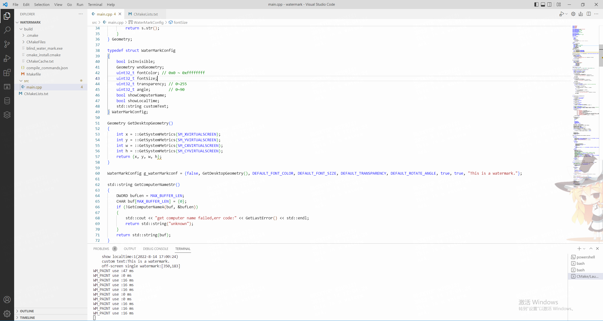
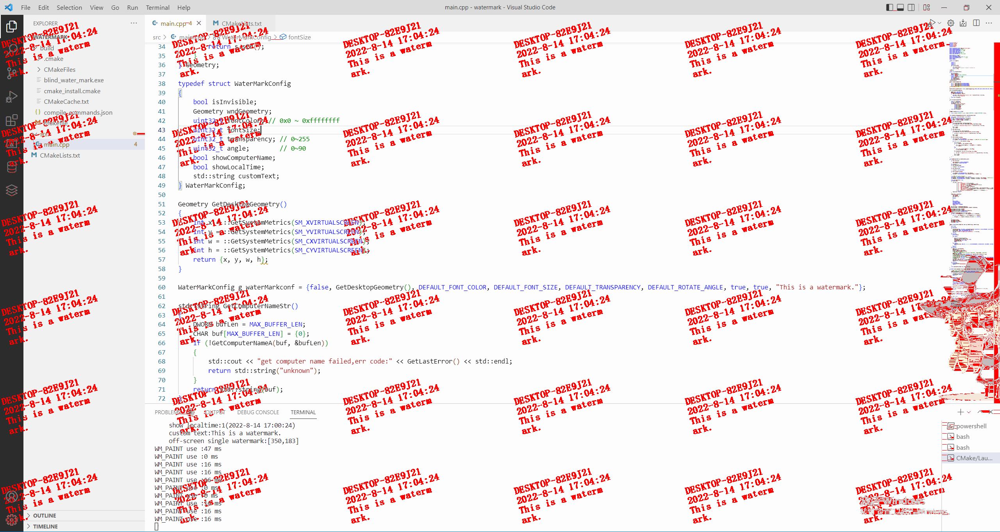

# 简介
这是一种实时隐蔽水印（类似于盲水印）实现方案，可以用于云桌面和远程桌面等场景，在敏感信息被截图外流之后，通过截图解析可以得到水印，用于溯源。  

与明水印相比，该方案实现的水印肉眼不可见，有效降低对正常操作的干扰。  

与基于频域变换的实现方法相比，该方法使用与明水印相同的线性混合来添加水印，对计算资源消耗极底，几乎不消耗CPU资源，所以可做到实时添加。  

仅实现了Windows操作系统下的叠加水印，其他平台可参考实现。  

解析效果良好，但是在某些场景还是有局限性。

# Description
This is a real-time concealed watermark (similar to blind watermark) implementation scheme, which can be used in scenarios such as cloud desktop and remote desktop. After the inscription information is leaked out of the screenshot, the watermark can be obtained through screenshot analysis for traceability.

Compared with the clear watermark, the watermark realized by this scheme is invisible to the naked eye, which effectively reduces the interference to the normal operation.

Compared with the implementation method based on spatial transformation, this method uses the same linear mixing as the clear watermark to add watermarks, which consumes extremely low computing resources and hardly consumes CPU resources, so it can be added in real time.

Only the superimposed watermark under the Windows operating system is implemented, and other platforms can refer to the implementation.

The parsing effect is good, but there are still limitations in some scenarios.

- 添加水印之后的截图 (source image)

- 解码结果 (decoded)
